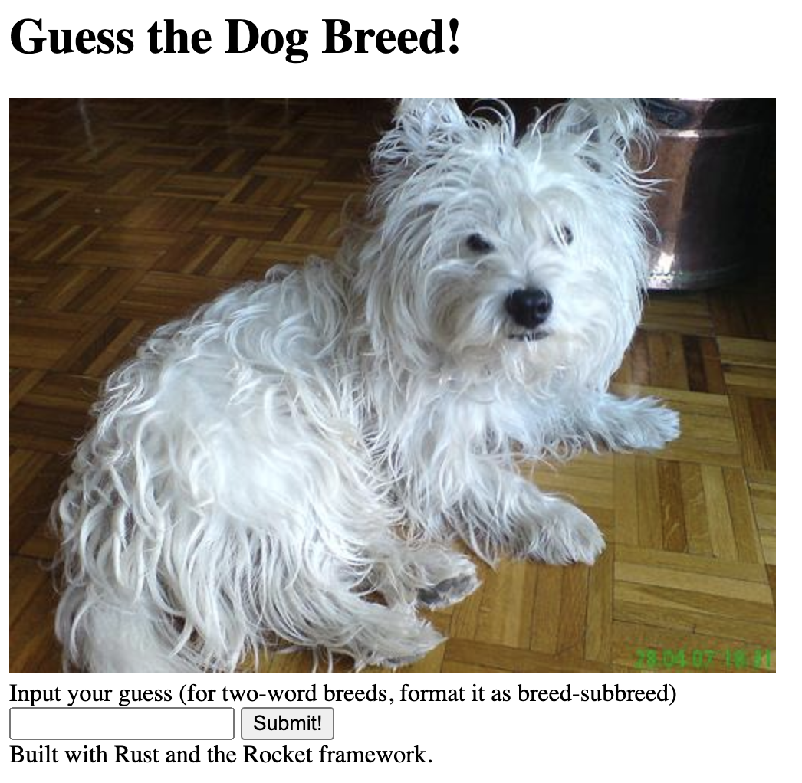
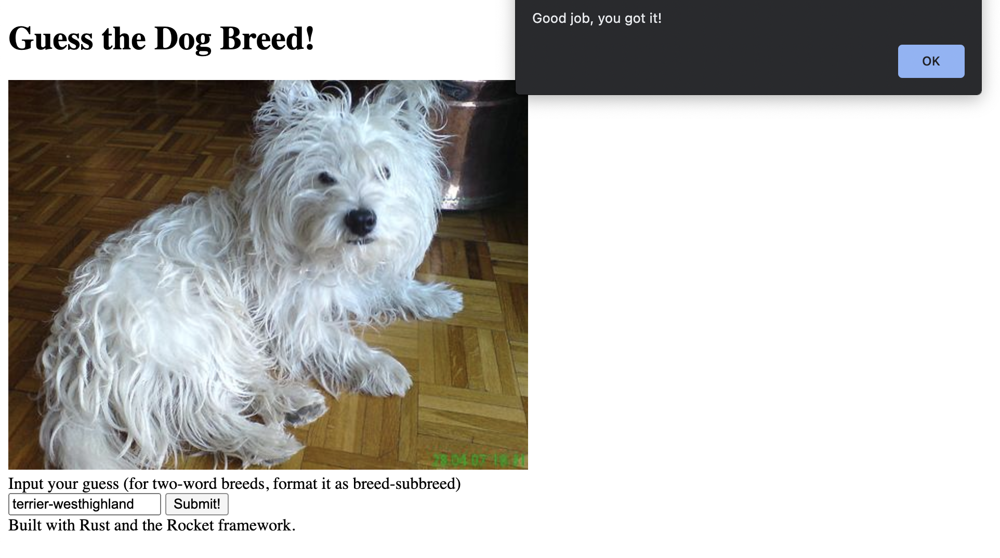
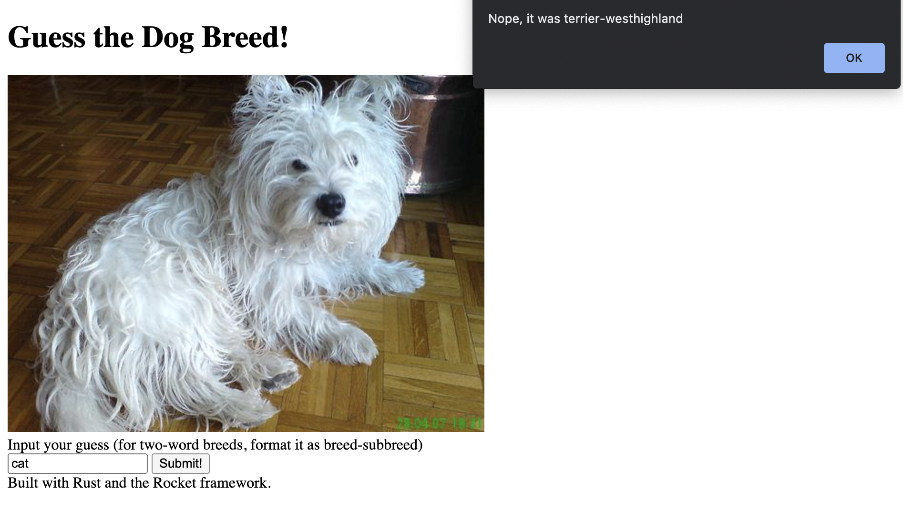

# It's not actually puzzle dogs

I was going to do something else that would be puzzle dogs but it's not. And I'm far too lazy to RENAME things.
This is a game where you are given a random dog image and you guess what breed it is.
I made this for NYU CS Discord server's first "Code Swap" event. I don't think something like this should be written
in Rust, but I wanted to get experience with Rust. Whoever gets this should have a far easier time than I did making this.
GLHF!

# Running it
Install Rust: https://rustup.rs/

From this folder, simply run `cargo run`

Play the game on localhost:8080
